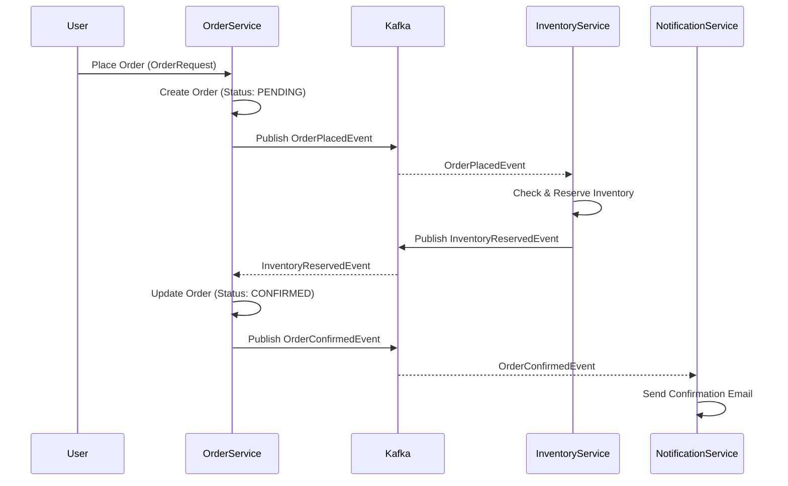
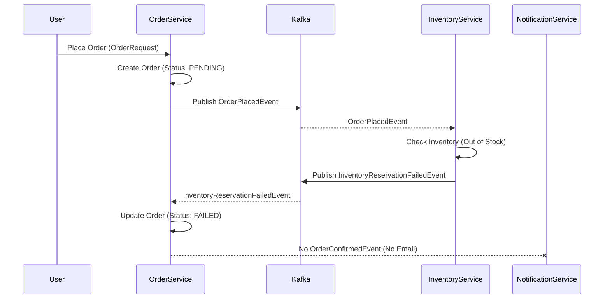

# Choreography-based Saga Pattern for Order Processing

This document explains the distributed transaction management using the Choreography-based Saga pattern implemented across the `order-service`, `inventory-service`, and `notification-service`.

## Core Components

*   **Kafka**: The central message broker for asynchronous communication between services.
*   **Avro & Schema Registry**: Used to define a strict, versioned contract for messages (events) exchanged via Kafka, ensuring data compatibility and preventing runtime errors during schema evolution.

## Saga Flow: Success Scenario (Order Confirmation)

The goal is to successfully place an order, reserve inventory, and notify the customer.

1.  **User Places Order (Order Service)**
    *   The `OrderService` receives an `OrderRequest`.
    *   It creates a new `Order` entity in its database with the `status` set to **`PENDING`**.
    *   It then publishes an `OrderPlacedEvent` to the Kafka topic `order-placed`. This event contains details like `orderNumber`, `skuCode`, `email`, `firstName`, `lastName`.
    *   **Key Point**: The `OrderService` does NOT directly call the `InventoryService`. It simply announces that an order has been placed.

2.  **Inventory Reservation (Inventory Service)**
    *   The `InventoryService` has a Kafka Listener (`InventoryKafkaListener`) subscribed to the `order-placed` topic.
    *   Upon receiving an `OrderPlacedEvent`, the `InventoryService` attempts to reserve the requested `skuCode` and quantity in its database.
    *   If the reservation is successful:
        *   It updates its local inventory.
        *   It publishes an `InventoryReservedEvent` (containing the `orderNumber`) to the Kafka topic `inventory-reserved`.

3.  **Order Confirmation (Order Service)**
    *   The `OrderService` has another Kafka Listener (`OrderKafkaListener`) subscribed to the `inventory-reserved` topic.
    *   Upon receiving an `InventoryReservedEvent`, the `OrderService` finds the corresponding `PENDING` order.
    *   It updates the `Order` entity's `status` to **`CONFIRMED`**.
    *   It then publishes an `OrderConfirmedEvent` (containing `orderNumber`, `email`, `firstName`, `lastName`) to the Kafka topic `order-confirmed`.

4.  **Customer Notification (Notification Service)**
    *   The `NotificationService` has a Kafka Listener subscribed to the `order-confirmed` topic.
    *   Upon receiving an `OrderConfirmedEvent`, it extracts the customer's email and order details.
    *   It sends a confirmation email to the customer.

## Saga Flow: Failure Scenario (Inventory Out of Stock)

This scenario demonstrates how the Saga handles a failure in one of the distributed steps, performing a compensating action.

1.  **User Places Order (Order Service)**
    *   Same as the success scenario: `OrderService` creates `Order` with `status` **`PENDING`** and publishes `OrderPlacedEvent` to `order-placed`.

2.  **Inventory Reservation Fails (Inventory Service)**
    *   The `InventoryService`'s Kafka Listener receives the `OrderPlacedEvent`.
    *   It attempts to reserve inventory, but finds that the product is **out of stock** or the requested quantity is unavailable.
    *   Instead of reserving, it publishes an `InventoryReservationFailedEvent` (containing the `orderNumber`) to the Kafka topic `inventory-reservation-failed`.

3.  **Order Failure (Order Service)**
    *   The `OrderService`'s Kafka Listener (`OrderKafkaListener`) is also subscribed to the `inventory-reservation-failed` topic.
    *   Upon receiving an `InventoryReservationFailedEvent`, the `OrderService` finds the corresponding `PENDING` order.
    *   It updates the `Order` entity's `status` to **`FAILED`**. This is the **compensating action** for the initial order creation. No further events (like `OrderConfirmedEvent`) are published.
    *   **Key Point**: The `NotificationService` will not receive an `OrderConfirmedEvent`, so no email will be sent for this failed order.

## Benefits of this Saga Implementation

*   **Decoupling**: Services communicate asynchronously via events, reducing direct dependencies.
*   **Resilience**: If one service is temporarily unavailable, messages are queued in Kafka and processed when the service recovers.
*   **Consistency**: Eventual consistency is achieved. The `OrderService` acts as the orchestrator by reacting to events from other services to manage the overall transaction state.
*   **Scalability**: Services can be scaled independently.
*   **Auditing**: Kafka provides a natural audit log of all events that occurred during the Saga.
*   **Schema Evolution**: Avro and Schema Registry ensure that changes to event structures can be managed without breaking consumers.
